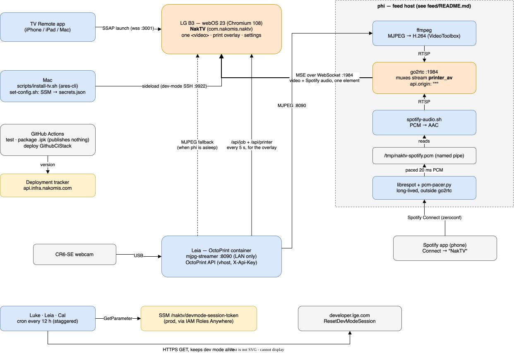

# NakTV — a launcher app for the LG TV, starting with the 3D printer camera


Remotes have a Netflix button. Mine has a NakTV button. It opens a tabbed app
on the 77" LG, and the first tab shows the 3D printer's camera full-screen, so a
print can be watched from the sofa.

## Support

If you find this useful, please consider buying me a coffee:

[](https://www.paypal.com/donate?hosted_button_id=Q3BESC73EWVNN&custom=naktv)

## Table of Contents

<!-- toc -->

- [Architecture Diagram](#architecture-diagram)
- [What it does](#what-it-does)
- [Repository layout](#repository-layout)
- [Adding a tab](#adding-a-tab)
- [Why it's built the way it is](#why-its-built-the-way-it-is)
- [Setting up the TV](#setting-up-the-tv)
- [Building and installing](#building-and-installing)
- [Testing](#testing)
- [CI and releases](#ci-and-releases)
- [Architecture Diagrams](#architecture-diagrams)
- [Support](#support)

<!-- tocstop -->

## Architecture Diagram



## What it does

- **Tab strip** across the top. It is up when the app opens and whenever a key
  is pressed, and fades after four seconds so the picture has the whole screen.
  While it is hidden a keypress only brings it back; while it is up, Left and
  Right change tab and Down dismisses it. Back exits. The Magic Remote pointer
  works too.
- **Printer Cam** shows OctoPrint's mjpg-streamer feed scaled to fill the
  screen. It reconnects after a dropout, falls back to polling single frames
  if the stream keeps failing, and retries the stream every five minutes.
- **No screen saver.** The app vetoes webOS's screen saver, which would
  otherwise cover a static-looking feed after a few idle minutes.
- The **NakTV button** lives in [tv-remote](https://github.com/nakomis/tv-remote)
  and launches the app over SSAP (`ssap://system.launcher/launch`).

## Repository layout

```
app/                 The webOS app: Vite + React + TypeScript, plain CSS
  src/shell/         Tab strip, key handling, auto-hide
  src/tabs/          One directory per tab, plus registry.ts
  src/webos/         webOS platform glue (screen-saver veto)
  webos/             appinfo.json and launcher icons, copied into dist/
infra/               CDK: GithubCiStack, the OIDC role CI assumes
scripts/install-tv.sh  Build, sideload and relaunch on the TV
docs/                Logo, candidates and architecture diagram
```

## Adding a tab

Write a component under `app/src/tabs/<name>/` and add one entry to
`app/src/tabs/registry.ts`. Only the active tab is mounted, so a tab starts its
work on mount and must release streams and timers on unmount.

## Why it's built the way it is

The LG B3 runs webOS 23, whose browser engine is **Chromium 108** (from the
TV's own user agent). That rules some things out:

- **No Tailwind 4.** It needs Chrome 111+. The CSS is plain and sized in `vh`.
- **No ES modules.** A sideloaded app loads from `file://`, where the origin is
  `null`, and Chromium refuses module scripts from a null origin. The bundle is
  built as one IIFE, and a small Vite plugin turns the tags into a classic
  `<script defer>`. The symptom when this goes wrong is a black screen.
- **Leia's IP, not `leia.local`.** webOS doesn't reliably resolve mDNS.
- **A cleartext LAN port for the camera.** The `*.home.nakomis.com` vhosts need
  an mTLS client certificate, which a sideloaded app cannot present, so
  mjpg-streamer is exposed on Leia at `:8090` for the LAN only.

## Setting up the TV

1. Install **Developer Mode** from the LG Content Store and sign in with an LG
   developer account.
2. Turn on **Dev Mode Status** (the TV restarts), then turn on **Key Server**
   and note the passphrase.
3. On the Mac, register the TV as `b3` and fetch its key:

   ```sh
   cd app && pnpm install
   pnpm exec ares-setup-device          # name b3, IP 172.29.0.19, port 9922
   pnpm exec ares-novacom --device b3 --getkey
   ```

Developer Mode sessions expire after about 50 hours unless they are reset, and
an expired session takes the sideloaded apps with it. Luke, Leia and Cal each
reset the session every twelve hours, staggered four hours apart (see
`home-servers`). The token they use is kept in SSM at
`/naktv/devmode-session-token` in the prod account. If Developer Mode is ever
set up from scratch the token changes, so it has to be written again:

```sh
# ares-novacom prints an "[Info] Set target device" line on stdout, so keep
# only the hex token line. Don't echo it: it re-arms the TV's dev mode.
TOKEN=$(pnpm exec ares-novacom --device b3 --run 'cat /var/luna/preferences/devmode_enabled' \
  | grep -E '^[0-9a-f]{32,}$' | tail -1)
aws ssm put-parameter --profile nakom.is-admin --region eu-west-2 \
  --name /naktv/devmode-session-token --type SecureString --overwrite --value "$TOKEN"
```

The reset endpoint answers `{"result":"success","errorCode":"200",…}` when it
works.

## Building and installing

```sh
cd app
pnpm install
pnpm dev                     # in a desktop browser; Esc stands in for Back
pnpm run install-tv          # build, package, sideload and relaunch on the TV
../scripts/install-tv.sh --latest   # install the newest GitHub Release instead
```

Set `TV_DEVICE` to target a device other than `b3`.

To debug on the TV, run `pnpm exec ares-inspect --device b3 --app com.nakomis.naktv`
and open the URL it prints in Chrome.

## Testing

```sh
cd app && pnpm lint && pnpm typecheck && pnpm test     # Vitest, 70% line floor
cd infra && pnpm typecheck && pnpm test                # Jest
```

## CI and releases

On a pull request, GitHub Actions lints, typechecks, tests and packages the app,
and tests and synthesises the infra. A merge to `main` computes the next version
from the shared deployment tracker, then:

- **publishes the `.ipk` as a GitHub Release** and records it as the prod
  deployment (the TV sits on the LAN, so installing it is still a manual
  `install-tv.sh --latest`);
- **deploys `GithubCiStack`** to sandbox, then to prod after approval, when
  `infra/` has changed.

Put `--bump-minor` or `--bump-major` in the PR title or description to bump
more than the patch number.

## Architecture Diagrams

`docs/architecture/naktv.drawio` is the source for the diagram above.
The SVG is auto-regenerated on commit by the pre-commit hook in `.githooks/pre-commit`.

To activate the hook after cloning:

```bash
git config core.hooksPath .githooks
```

## Support

If you find this useful, please consider buying me a coffee:

[](https://www.paypal.com/donate?hosted_button_id=Q3BESC73EWVNN&custom=naktv)
